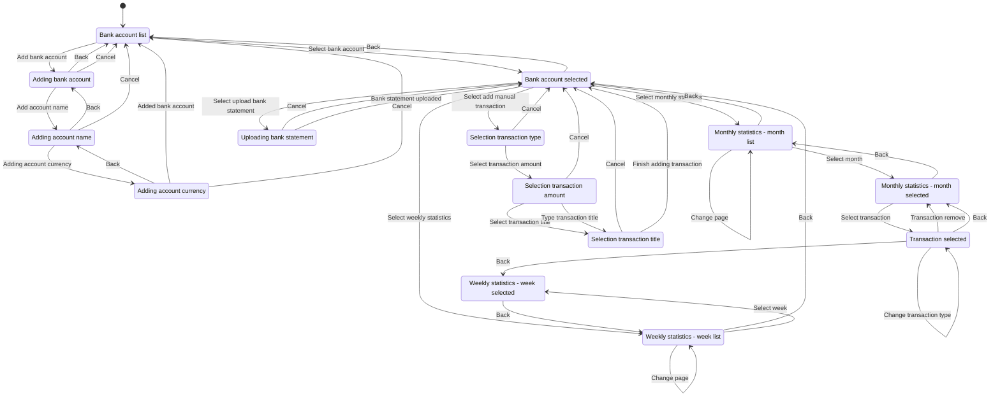

# Telegram expense tracker

A Telegram bot for tracking expenses. The goal was to create a unified way to track expenses across different bank cards / currencies and family members,  with an option to exclude specific transactions from statistics. Useful if you're traveller and live in different countries.

 Available features:
- Multi user account support. You can give access to your family's budget to anyone from your family
- Multi bank account support with different currencies
- Montly and weekly expense / income statistics
- Allow to exclude specific transactions from statistics. Example use case - your friends asked you to pay for something online and then returned you this amount in cash or in crypto. You don't want to count this transaction as a spending. Or you'd like to exclude all the cash withdrawals from the statistics because they're not spendings.
- Parsing bank statements (currently only for Yapı Kredi Bankası, but other banks can be added)
- Manual transacton entries for tracking cash
- Smooth app-like bot experience using [editMessageReplyMarkup](https://core.telegram.org/bots/api#editmessagereplymarkup)

### Screenshots

### Finite state machine visualization

The visualization is generated using [mermaid.js](https://github.blog/2022-02-14-include-diagrams-markdown-files-mermaid/)

